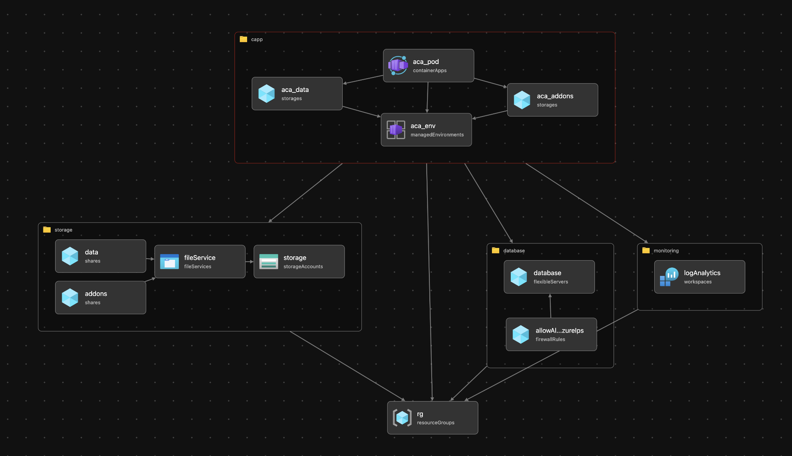

# Deploy of a Container App using BICEP

## Summary

This is a simple demo on how to deploy and expose Web App that uses:

- Docker Container as the Web App
- PostgreSQL Database
- Azure File Share Mounts

### Azure Services
The following Azure Services were used:
- Azure Storage Account
- Azure File Share
- Azure Log Analytics
- Azure Containers App
- Azure Postgresql Flexible Server

## Architecture (in Bicep)




## How to Use It

```sh
REGION='xxxxx'
az deployment sub create --location $REGION --template-file  ./IaC/main.bicep -c

az group list -o table
RG=""
az group delete --resource-group $RG --yes
```

## Todo

- Azure Container Registry
- Azure Key Vault
